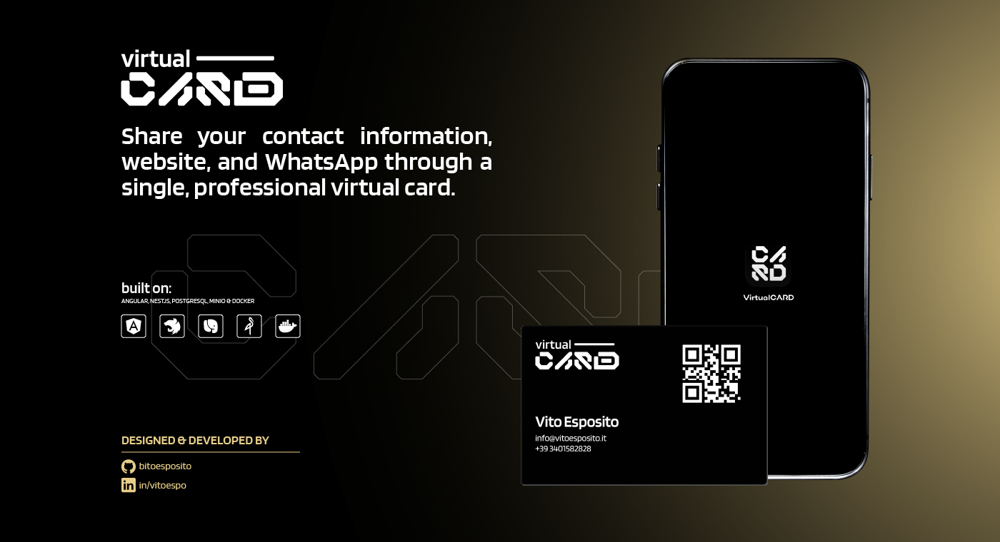
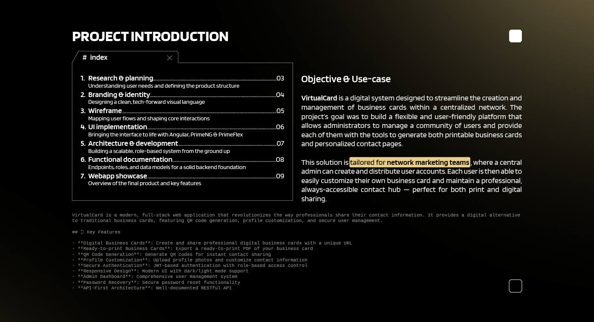
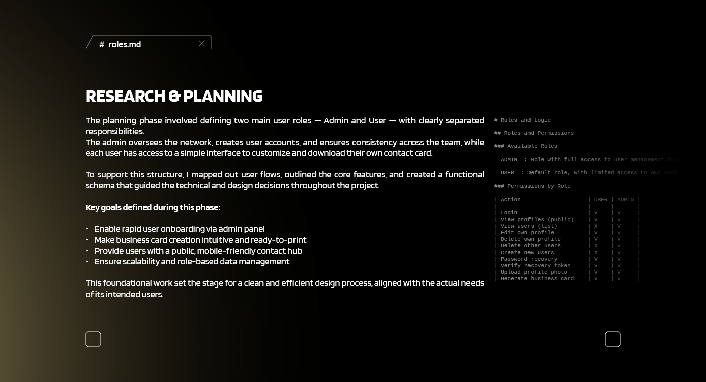
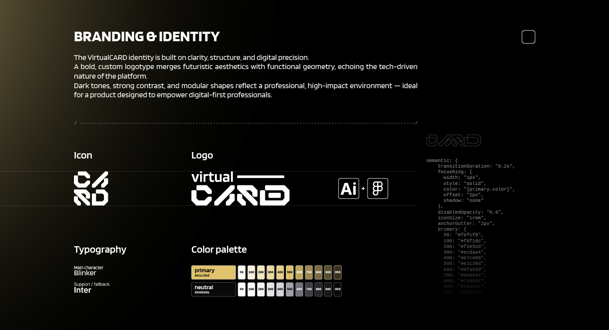
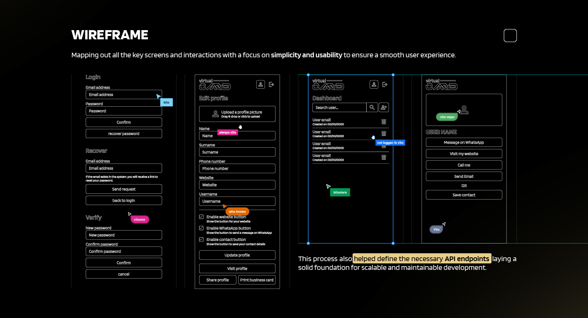
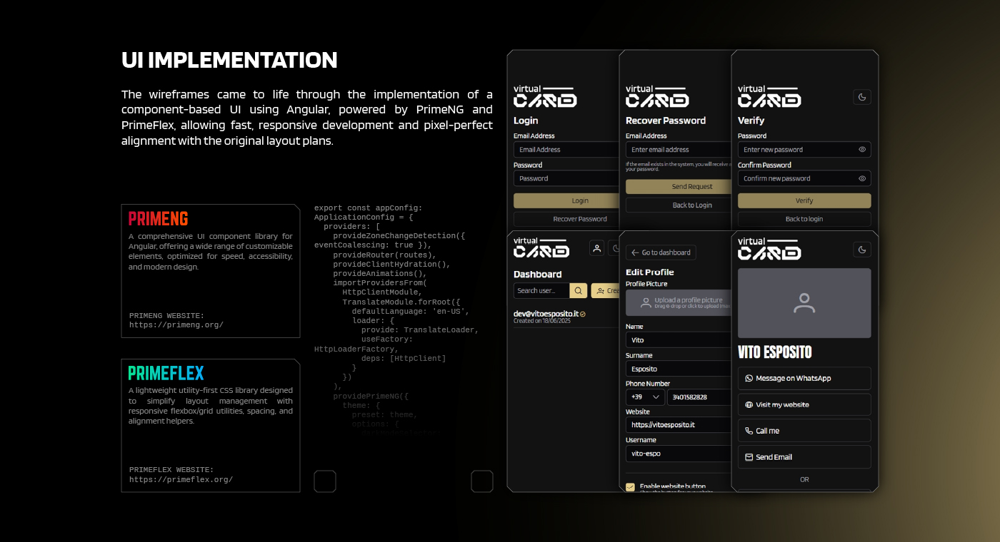
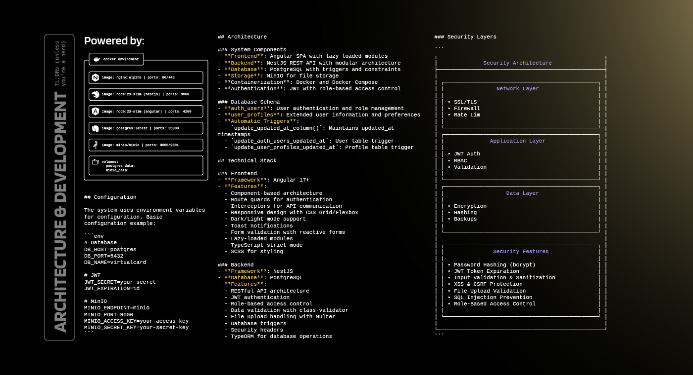
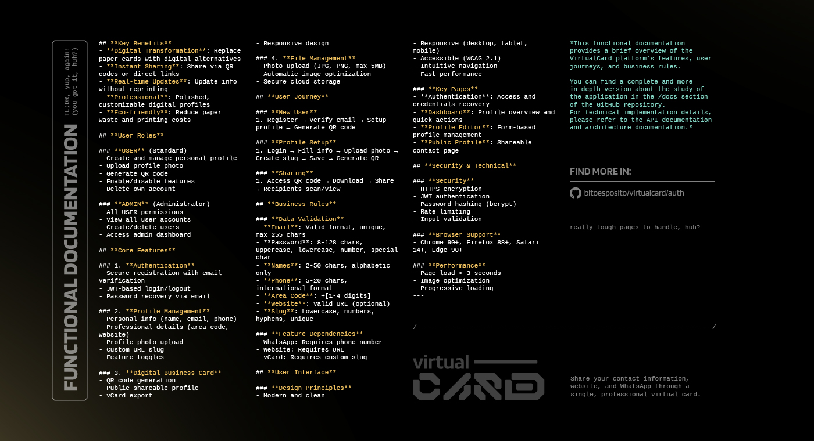
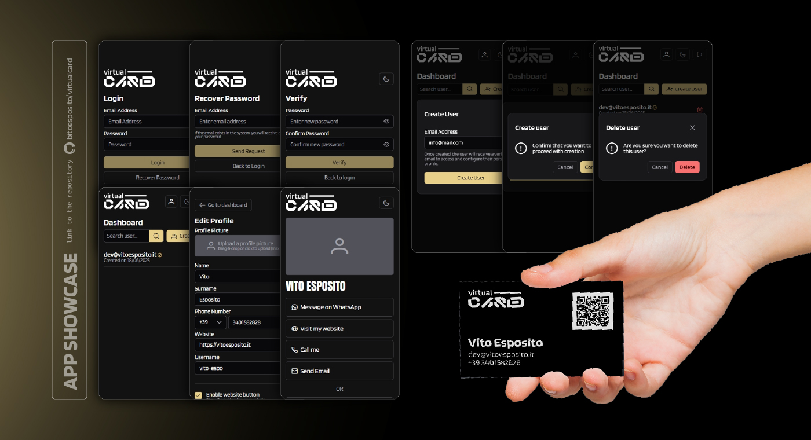
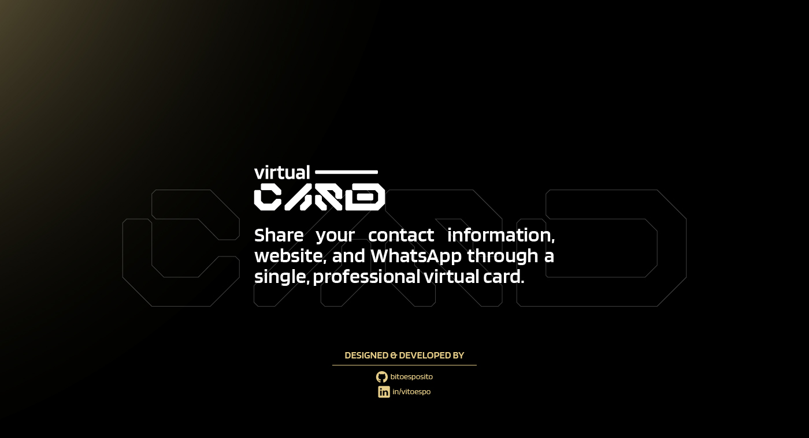

# VirtualCard - Digital Business Card Platform

VirtualCard is a modern, full-stack web application that revolutionizes the way professionals share their contact information. It provides a digital alternative to traditional business cards, featuring QR code generation, profile customization, and secure user management.

## 📸 Presentation

